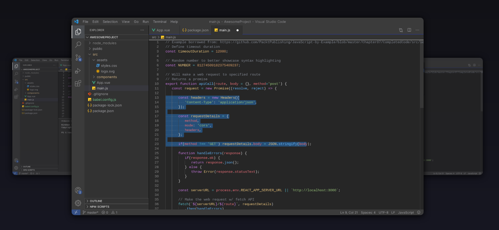

# JetBrains Rider Dark Theme

VSCode Theme based on JetBrains Rider Dark theme.



## Installing

This extension is available for free in the Visual Studio Code [Marketplace](https://marketplace.visualstudio.com/items?itemName=EdwinSulaiman.jetbrains-rider-dark-theme)

## What's new?

Click here to go to the [Changelog](https://github.com/edsulaiman/jetbrains-rider-dark-theme/blob/main/CHANGELOG.md)

## Inconsistencies?

If you find any inconsistency in any language, raise an [Issue](https://github.com/edsulaiman/jetbrains-rider-dark-theme/issues) and I'll fix it, please provide a sample for the language so I can compare.

## Custom Font

The original JetBrains Rider use "JetBrains Mono" font family,
You can [download](https://www.jetbrains.com/lp/mono/) and install the font in your system, and add this option to have a custom font:

```json
{
  "editor.fontSize": 13,
  "editor.lineHeight": 22,
  "editor.fontFamily": "JetBrains Mono"
}
```

## Credits

- [JetBrains](https://www.jetbrains.com/)
- [JetBrains Rider](https://www.jetbrains.com/rider/)
